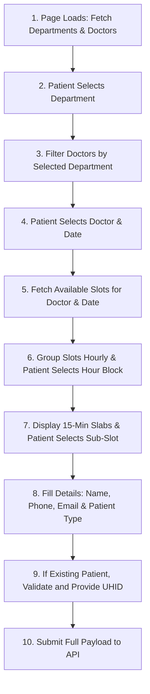

# PHP Booking Appointment Integration Guide
**Base API URL**: `https://api.nemcare.com/api`

This guide outlines the dynamic flow and APIs required to build the appointment booking form on your public PHP website (`book-an-appointment.php`). It matches the exact hourly-slot grouping and 15-minute slab booking logic used in the React admin dashboard.

---

## 📅 The Booking Flow Overview

To ensure patients only book available doctor slabs, the form is split into distinct sequential steps:



---

## 🔗 Step-by-Step API Details

### Step 1: Fetch Departments
Retrieve all available hospital departments to populate the "Specialty / Department" dropdown.

* **Endpoint**: `GET https://api.nemcare.com/api/departments`
* **Response Structure**:
  ```json
  {
    "data": [
      {
        "id": 1,
        "name": "Cardiology",
        "description": "Heart care and surgeries"
      },
      {
        "id": 2,
        "name": "Pediatrics",
        "description": "Children's health"
      }
    ]
  }
  ```

---

### Step 2: Fetch Doctors
Retrieve the doctors list to populate the "Doctor" dropdown.

* **Endpoint**: `GET https://api.nemcare.com/api/doctors`
* **Response Structure**:
  ```json
  {
    "data": [
      {
        "id": 1,
        "name": "Dr. Sarah Connor",
        "designation": "Senior Cardiologist",
        "department_id": 1
      },
      {
        "id": 2,
        "name": "Dr. Alan Vance",
        "designation": "Pediatric Consultant",
        "department_id": 2
      }
    ]
  }
  ```
> [!TIP]
> Filter the Doctor dropdown options dynamically: show only doctors where `doctor.department_id` matches the selected Department's ID.

---

### Step 3: Fetch Available Slots (Hourly & 15-Min Slabs)
Once a patient has selected a **Doctor** and a **Date** (format: `YYYY-MM-DD`), fetch that doctor's time slot status for that date. The API returns 15-minute sub-slots (slabs) which contain a reference to their parent 1-hour master slot.

* **Endpoint**: `GET https://api.nemcare.com/api/doctors/{doctor_id}/slots?date={YYYY-MM-DD}`
* **Response Structure**:
  ```json
  {
    "data": {
      "doctor": { "id": 1, "name": "Dr. Sarah Connor" },
      "date": "2026-06-15",
      "slots": [
        {
          "id": 1,
          "start_time": "10:00",
          "end_time": "10:15",
          "master_slot_id": 2,
          "is_booked": false,
          "is_manually_disabled": false,
          "available": true
        },
        {
          "id": 2,
          "start_time": "10:15",
          "end_time": "10:30",
          "master_slot_id": 2,
          "is_booked": true,
          "is_manually_disabled": false,
          "available": false
        }
      ]
    }
  }
  ```

#### How to Group Slabs Hourly on the Frontend:
1. **Group by `master_slot_id`**: Map the array of slots and group them by their `master_slot_id` key.
2. **Determine Hour Window**: For each group, sort its slabs by `start_time` ascending. The parent hour's `start_time` is the first slab's start time and its `end_time` is the last slab's end time (e.g. Group containing `10:00-10:15`, `10:15-10:30`, `10:30-10:45`, `10:45-11:00` represents the parent block **10:00 AM - 11:00 AM**).
3. **Double Selection UI**: Show the parent hour blocks first. Once the patient selects an hour, display the nested 15-minute sub-slots (slabs) belonging to that hour.

> [!IMPORTANT]
> **Show Booked Slots in the UI**: Do NOT filter out or hide booked/disabled slots. They must be displayed in the UI so patients know they exist, but styled as disabled/unselectable with a clear **(Booked)** label. 


---

### Step 4: Book the Appointment
Submit the chosen slot, date, doctor, patient contact details, patient type, and UHID to confirm the booking.

* **Endpoint**: `POST https://api.nemcare.com/api/appointments`
* **Content-Type**: `application/json`
* **Request Payload**:
  ```json
  {
    "doctor_id": 1,
    "slot_id": 2, // The master_slot_id of the selected slab (e.g. 2)
    "slab_start_time": "10:15", // The start_time of the specific 15-min slab
    "slab_end_time": "10:30", // The end_time of the specific 15-min slab
    "date": "2026-06-15",
    "patient_name": "John Doe",
    "patient_email": "john@example.com", // Optional
    "patient_phone": "1234567890", // Must be exactly 10 digits
    "patient_type": "existing", // "new" or "existing"
    "uhid": "UHID12345" // Required only if patient_type is "existing"
  }
  ```

* **Response (Success)**:
  ```json
  {
    "success": true,
    "message": "Appointment booked successfully",
    "data": {
      "id": 12,
      "patient_name": "John Doe",
      "patient_type": "existing",
      "uhid": "UHID12345",
      "doctor_id": 1,
      "slot_id": 2,
      "slab_start_time": "10:15",
      "slab_end_time": "10:30",
      "date": "2026-06-15",
      "status": "booked"
    }
  }
  ```

---

## 💻 Sample Implementation Code for `book-an-appointment.php`

### Option A: Modern Frontend JavaScript (Recommended)
Add this styling and script directly to your PHP/HTML template to load options dynamically.

```html
<!-- book-an-appointment.php -->
<style>
  .appointment-form { max-width: 600px; margin: 0 auto; font-family: sans-serif; }
  .form-group { margin-bottom: 20px; display: flex; flex-direction: column; gap: 6px; }
  .form-group label { font-size: 12px; font-weight: bold; color: #475569; text-transform: uppercase; }
  .form-group input, .form-group select { padding: 10px 14px; border: 1px solid #cbd5e1; border-radius: 8px; font-size: 14px; }
  .radio-group { display: flex; gap: 15px; margin: 5px 0; }
  .radio-option { display: flex; items-center: center; gap: 6px; font-size: 13px; font-weight: 600; cursor: pointer; }
  
  /* Hourly Slots and Slabs Grids */
  .grid-container { display: grid; grid-template-columns: repeat(2, 1fr); gap: 10px; margin-top: 5px; }
  .slot-btn { padding: 12px; border: 1px solid #cbd5e1; background: #fff; border-radius: 8px; font-size: 13px; font-weight: bold; cursor: pointer; transition: all 0.2s; text-align: center; }
  .slot-btn:hover { border-color: #94a3b8; }
  .slot-btn.active { background: #1e293b; color: #fff; border-color: #1e293b; }
  
  .slab-chip { display: flex; align-items: center; justify-content: center; padding: 10px; border: 1px solid #cbd5e1; border-radius: 8px; font-size: 12px; font-weight: bold; background: #f8fafc; transition: all 0.2s; cursor: pointer; position: relative; }
  .slab-chip input { position: absolute; opacity: 0; pointer-events: none; }
  .slab-chip.selected { background: #fee2e2; border-color: #960c0c; color: #960c0c; }
  .slab-chip.booked { opacity: 0.6; background: #e2e8f0; border-color: #cbd5e1; color: #64748b; cursor: not-allowed; }
  
  .hidden { display: none !important; }
  .error-text { color: #dc2626; font-size: 12px; font-weight: bold; }
  .placeholder-text { font-size: 13px; color: #64748b; font-style: italic; }
  #submitBtn { padding: 12px; border: none; background: #960c0c; color: white; font-weight: bold; border-radius: 8px; cursor: pointer; font-size: 14px; margin-top: 10px; }
  #submitBtn:disabled { background: #cbd5e1; color: #94a3b8; cursor: not-allowed; }
</style>

<form id="appointmentForm" class="appointment-form">
  <!-- 1. Department Dropdown -->
  <div class="form-group">
    <label for="department">Select Specialty</label>
    <select id="department" required>
      <option value="">Choose a Specialty...</option>
    </select>
  </div>

  <!-- 2. Doctor Dropdown -->
  <div class="form-group">
    <label for="doctor">Select Doctor</label>
    <select id="doctor" required disabled>
      <option value="">Choose Specialty First...</option>
    </select>
  </div>

  <!-- 3. Date Selection -->
  <div class="form-group">
    <label for="date">Select Date</label>
    <input type="date" id="date" required disabled>
  </div>

  <!-- 4. Hour Selection (Master Slots) -->
  <div class="form-group">
    <label>Select Time Window</label>
    <div id="hours-container" class="grid-container">
      <p class="placeholder-text">Please select doctor and date first.</p>
    </div>
  </div>

  <!-- 5. 15-Minute Slabs Selection -->
  <div id="slabs-section" class="form-group hidden">
    <label>Select 15-Minute Slot</label>
    <div id="slabs-container" class="grid-container"></div>
  </div>

  <!-- 6. Patient Type Toggle -->
  <div class="form-group">
    <label>Are you a new patient?</label>
    <div class="radio-group">
      <label class="radio-option">
        <input type="radio" name="patient_type" value="new" checked required> New Patient
      </label>
      <label class="radio-option">
        <input type="radio" name="patient_type" value="existing"> Existing Patient
      </label>
    </div>
  </div>

  <!-- 7. UHID Input (Conditional) -->
  <div id="uhid-group" class="form-group hidden">
    <label for="uhid">UHID (Hospital ID) *</label>
    <input type="text" id="uhid" placeholder="Enter your hospital UHID">
  </div>

  <!-- 8. Patient Information -->
  <div class="form-group">
    <label for="patient_name">Your Name</label>
    <input type="text" id="patient_name" required>
  </div>
  
  <div class="form-group">
    <label for="patient_phone">Phone Number (10 digits)</label>
    <input type="tel" id="patient_phone" pattern="[0-9]{10}" placeholder="e.g. 9876543210" required>
  </div>
  
  <div class="form-group">
    <label for="patient_email">Email Address (Optional)</label>
    <input type="email" id="patient_email">
  </div>

  <button type="submit" id="submitBtn">Book Appointment</button>
</form>

<script>
const BASE_URL = 'https://api.nemcare.com/api';
let allDoctors = [];
let availableSlots = [];
let groupedSlots = {};
let selectedMasterId = null;

document.addEventListener('DOMContentLoaded', async () => {
  const deptSelect = document.getElementById('department');
  const docSelect = document.getElementById('doctor');
  const dateInput = document.getElementById('date');
  const hoursContainer = document.getElementById('hours-container');
  const slabsSection = document.getElementById('slabs-section');
  const slabsContainer = document.getElementById('slabs-container');
  const patientTypeRadios = document.getElementsByName('patient_type');
  const uhidGroup = document.getElementById('uhid-group');
  const uhidInput = document.getElementById('uhid');
  const form = document.getElementById('appointmentForm');

  // Set minimum date selection to today
  const today = new Date().toISOString().split('T')[0];
  dateInput.min = today;

  // Toggle UHID field visibility & requirement
  patientTypeRadios.forEach(radio => {
    radio.addEventListener('change', (e) => {
      if (e.target.value === 'existing') {
        uhidGroup.classList.remove('hidden');
        uhidInput.required = true;
      } else {
        uhidGroup.classList.add('hidden');
        uhidInput.required = false;
        uhidInput.value = '';
      }
    });
  });

  try {
    // 1. Fetch lookup lists
    const [deptRes, docRes] = await Promise.all([
      fetch(`${BASE_URL}/departments`),
      fetch(`${BASE_URL}/doctors`)
    ]);

    const depts = (await deptRes.json()).data || [];
    allDoctors = (await docRes.json()).data || [];

    // Populate Department Dropdown
    depts.forEach(dept => {
      const option = document.createElement('option');
      option.value = dept.id;
      option.textContent = dept.name;
      deptSelect.appendChild(option);
    });

    // 2. Specialty selection change handler
    deptSelect.addEventListener('change', () => {
      const selectedDept = deptSelect.value;
      docSelect.innerHTML = '<option value="">Choose a Doctor...</option>';
      resetSlotsUI();
      dateInput.disabled = true;
      dateInput.value = '';

      if (!selectedDept) {
        docSelect.disabled = true;
        return;
      }

      const filteredDocs = allDoctors.filter(d => d.department_id == selectedDept);
      filteredDocs.forEach(doc => {
        const option = document.createElement('option');
        option.value = doc.id;
        option.textContent = doc.name;
        docSelect.appendChild(option);
      });
      docSelect.disabled = false;
    });

    // 3. Doctor selection change handler
    docSelect.addEventListener('change', () => {
      resetSlotsUI();
      dateInput.value = '';
      dateInput.disabled = !docSelect.value;
    });

    // 4. Date selection change handler
    dateInput.addEventListener('change', loadSlots);

    function resetSlotsUI() {
      hoursContainer.innerHTML = '<p class="placeholder-text">Please select doctor and date first.</p>';
      slabsSection.classList.add('hidden');
      slabsContainer.innerHTML = '';
      selectedMasterId = null;
      availableSlots = [];
      groupedSlots = {};
    }

    async function loadSlots() {
      const doctorId = docSelect.value;
      const date = dateInput.value;
      if (!doctorId || !date) return;

      hoursContainer.innerHTML = '<p class="placeholder-text">Loading available time windows...</p>';
      slabsSection.classList.add('hidden');
      slabsContainer.innerHTML = '';

      try {
        const res = await fetch(`${BASE_URL}/doctors/${doctorId}/slots?date=${date}`);
        const result = await res.json();
        availableSlots = (result.data || result).slots || [];

        if (availableSlots.length === 0) {
          hoursContainer.innerHTML = '<p class="error-text">No slots operational on this date.</p>';
          return;
        }

        // Group slots hourly by master_slot_id
        groupedSlots = {};
        availableSlots.forEach(slot => {
          const mid = slot.master_slot_id;
          if (!groupedSlots[mid]) {
            groupedSlots[mid] = { master_slot_id: mid, slabs: [] };
          }
          groupedSlots[mid].slabs.push(slot);
        });

        // Convert grouped object to array & sort hourly
        const groupsArray = Object.values(groupedSlots).map(group => {
          group.slabs.sort((a, b) => a.start_time.localeCompare(b.start_time));
          return {
            master_slot_id: group.master_slot_id,
            slabs: group.slabs,
            master_start_time: group.slabs[0].start_time,
            master_end_time: group.slabs[group.slabs.length - 1].end_time
          };
        }).sort((a, b) => a.master_start_time.localeCompare(b.master_start_time));

        hoursContainer.innerHTML = '';
        groupsArray.forEach(group => {
          const btn = document.createElement('button');
          btn.type = 'button';
          btn.className = 'slot-btn';
          btn.textContent = `${formatTimeTo12Hour(group.master_start_time)} - ${formatTimeTo12Hour(group.master_end_time)}`;
          btn.addEventListener('click', () => {
            document.querySelectorAll('.slot-btn').forEach(b => b.classList.remove('active'));
            btn.classList.add('active');
            displaySlabs(group.master_slot_id);
          });
          hoursContainer.appendChild(btn);
        });

      } catch (err) {
        hoursContainer.innerHTML = '<p class="error-text">Error fetching slots. Please try again.</p>';
      }
    }

    // Display sub-slots (15-min slabs)
    function displaySlabs(masterId) {
      selectedMasterId = masterId;
      slabsContainer.innerHTML = '';
      slabsSection.classList.remove('hidden');

      const slabs = groupedSlots[masterId]?.slabs || [];
      slabs.forEach(slab => {
        const isBooked = slab.is_booked || !slab.available;
        const chip = document.createElement('label');
        chip.className = `slab-chip ${isBooked ? 'booked' : ''}`;
        
        const radio = document.createElement('input');
        radio.type = 'radio';
        radio.name = 'selected_slab_id';
        radio.value = slab.id;
        radio.disabled = isBooked;
        radio.required = true;

        const timeLabel = document.createElement('span');
        timeLabel.innerHTML = `${formatTimeTo12Hour(slab.start_time)} - ${formatTimeTo12Hour(slab.end_time)} ${isBooked ? '<br><small style="color:red">(Booked)</small>' : ''}`;

        chip.appendChild(radio);
        chip.appendChild(timeLabel);

        // Highlight selection
        radio.addEventListener('change', () => {
          document.querySelectorAll('.slab-chip').forEach(c => c.classList.remove('selected'));
          if (radio.checked) chip.classList.add('selected');
        });

        slabsContainer.appendChild(chip);
      });
    }

    // Time conversion helper
    function formatTimeTo12Hour(timeStr) {
      if (!timeStr) return '';
      const parts = timeStr.split(':');
      const hour = parseInt(parts[0], 10);
      const ampm = hour >= 12 ? 'PM' : 'AM';
      const displayHour = hour % 12 === 0 ? 12 : hour % 12;
      return `${displayHour}:${parts[1]} ${ampm}`;
    }

    // 5. Submit Booking Form
    form.addEventListener('submit', async (e) => {
      e.preventDefault();

      const selectedSlabRadio = document.querySelector('input[name="selected_slab_id"]:checked');
      if (!selectedSlabRadio) {
        alert('Please select a 15-minute time slot.');
        return;
      }

      const slabId = Number(selectedSlabRadio.value);
      const chosenSlab = availableSlots.find(s => s.id === slabId);
      const patientType = document.querySelector('input[name="patient_type"]:checked').value;
      const uhidValue = uhidInput.value.trim();

      if (patientType === 'existing' && !uhidValue) {
        alert('UHID is required for existing patients.');
        return;
      }

      const payload = {
        doctor_id: parseInt(docSelect.value),
        slot_id: Number(chosenSlab.master_slot_id), // Send the parent 1-hour master slot ID
        slab_start_time: chosenSlab.start_time,     // Send specific slab start
        slab_end_time: chosenSlab.end_time,         // Send specific slab end
        date: dateInput.value,
        patient_name: document.getElementById('patient_name').value.trim(),
        patient_phone: document.getElementById('patient_phone').value.trim(),
        patient_email: document.getElementById('patient_email').value.trim() || undefined,
        patient_type: patientType,
        uhid: patientType === 'existing' ? uhidValue : undefined
      };

      try {
        document.getElementById('submitBtn').disabled = true;
        document.getElementById('submitBtn').textContent = 'Booking in progress...';

        const res = await fetch(`${BASE_URL}/appointments`, {
          method: 'POST',
          headers: { 'Content-Type': 'application/json' },
          body: JSON.stringify(payload)
        });

        const data = await res.json();
        if (res.ok) {
          alert('Appointment booked successfully!');
          form.reset();
          resetSlotsUI();
          uhidGroup.classList.add('hidden');
          docSelect.disabled = true;
          dateInput.disabled = true;
        } else {
          alert('Booking Error: ' + (data.message || 'Failed to complete appointment.'));
        }
      } catch (err) {
        alert('Could not establish database connection. Please try again.');
      } finally {
        document.getElementById('submitBtn').disabled = false;
        document.getElementById('submitBtn').textContent = 'Book Appointment';
      }
    });

  } catch (err) {
    console.error('Initial dependency load failed:', err);
  }
});
</script>
```
