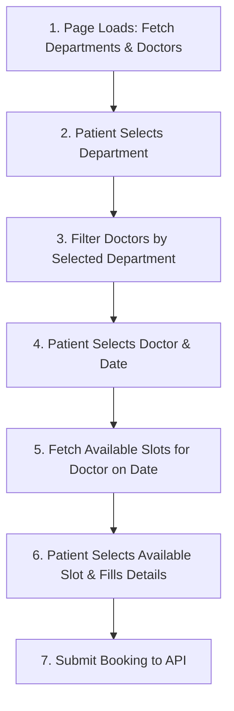

# PHP Booking Appointment Integration Guide
**Base API URL**: `https://api.nemcare.com/api`

This guide outlines the dynamic flow and APIs required to build the appointment booking form on your public PHP website (`book-an-appointment.php`).

---

## 📅 The Booking Flow Overview

To ensure patients only book available doctors and valid time slots, the booking form must be dynamic. The recommended flow is:



---

## 🔗 Step-by-Step API Details

### Step 1: Fetch Departments
Retrieve all available hospital departments to populate the "Specialty / Department" dropdown.

* **Endpoint**: `GET https://api.nemcare.com/api/departments`
* **Response Structure**:
  ```json
  {
    "data": [
      {
        "id": 1,
        "name": "Cardiology",
        "description": "Heart care and surgeries"
      },
      {
        "id": 2,
        "name": "Pediatrics",
        "description": "Children's health"
      }
    ]
  }
  ```

---

### Step 2: Fetch Doctors
Retrieve the doctors list to populate the "Doctor" dropdown.

* **Endpoint**: `GET https://api.nemcare.com/api/doctors`
* **Response Structure**:
  ```json
  {
    "data": [
      {
        "id": 1,
        "name": "Dr. Sarah Connor",
        "designation": "Senior Cardiologist",
        "department_id": 1
      },
      {
        "id": 2,
        "name": "Dr. Alan Vance",
        "designation": "Pediatric Consultant",
        "department_id": 2
      }
    ]
  }
  ```
> [!TIP]
> Filter the Doctor dropdown options dynamically using JavaScript: show only doctors where `doctor.department_id` matches the selected Department's ID.

---

### Step 3: Fetch Available Slots
Once a patient has selected a **Doctor** and a **Date** (format: `YYYY-MM-DD`), fetch that doctor's time slot status for that date.

* **Endpoint**: `GET https://api.nemcare.com/api/doctors/{doctor_id}/slots?date={YYYY-MM-DD}`
* **Response Structure**:
  ```json
  {
    "data": {
      "doctor": { "id": 1, "name": "Dr. Sarah Connor" },
      "date": "2026-06-15",
      "slots": [
        {
          "id": 1,
          "start_time": "10:00",
          "end_time": "10:15",
          "is_booked": false,
          "is_manually_disabled": false,
          "available": true
        },
        {
          "id": 2,
          "start_time": "10:15",
          "end_time": "10:30",
          "is_booked": true,
          "is_manually_disabled": false,
          "available": false
        }
      ]
    }
  }
  ```
> [!IMPORTANT]
> **Filtering Rule**: Display only the slots where `available === true` (which implies `is_booked === false` and `is_manually_disabled === false`). If no slots return `available: true`, show a message stating *"No slots available on this date."*

---

### Step 4: Book the Appointment
Submit the chosen slot, date, doctor, and patient contact details to confirm the booking.

* **Endpoint**: `POST https://api.nemcare.com/api/appointments`
* **Content-Type**: `application/json`
* **Request Payload**:
  ```json
  {
    "doctor_id": 1,
    "slot_id": 1,
    "date": "2026-06-15",
    "patient_name": "John Doe",
    "patient_email": "john@example.com", 
    "patient_phone": "1234567890"        
  }
  ```
  * *Note: `patient_name` and `patient_phone` are required. `patient_email` is optional. Phone number must be exactly 10 digits.*

* **Response (Success)**:
  ```json
  {
    "success": true,
    "message": "Appointment booked successfully",
    "data": {
      "id": 12,
      "patient_name": "John Doe",
      "doctor_id": 1,
      "slot_id": 1,
      "date": "2026-06-15",
      "status": "booked"
    }
  }
  ```

---

## 💻 Sample Implementation Code for `book-an-appointment.php`

Here are two ways to implement this in your PHP page. **Option A** (JavaScript Fetch) is highly recommended for a smooth, modern user experience without full-page reloads.

### Option A: Modern Frontend JavaScript (Recommended)
Add this script directly to your PHP/HTML template to load options dynamically.

```html
<!-- book-an-appointment.php -->
<form id="appointmentForm" class="appointment-form">
  <!-- 1. Department Dropdown -->
  <div class="form-group">
    <label for="department">Select Specialty</label>
    <select id="department" required>
      <option value="">Choose a Specialty...</option>
    </select>
  </div>

  <!-- 2. Doctor Dropdown -->
  <div class="form-group">
    <label for="doctor">Select Doctor</label>
    <select id="doctor" required disabled>
      <option value="">Choose Specialty First...</option>
    </select>
  </div>

  <!-- 3. Date Selection -->
  <div class="form-group">
    <label for="date">Select Date</label>
    <input type="date" id="date" required disabled>
  </div>

  <!-- 4. Time Slot Chips -->
  <div class="form-group">
    <label>Select Time Slot</label>
    <div id="slots-container" class="slots-grid">
      <p class="placeholder-text">Please select doctor and date first.</p>
    </div>
  </div>

  <!-- 5. Patient Information -->
  <div class="form-group">
    <label for="patient_name">Your Name</label>
    <input type="text" id="patient_name" required>
  </div>
  <div class="form-group">
    <label for="patient_phone">Phone Number (10 digits)</label>
    <input type="tel" id="patient_phone" pattern="[0-9]{10}" placeholder="9876543210" required>
  </div>
  <div class="form-group">
    <label for="patient_email">Email Address (Optional)</label>
    <input type="email" id="patient_email">
  </div>

  <button type="submit" id="submitBtn">Book Appointment</button>
</form>

<script>
const BASE_URL = 'https://api.nemcare.com/api';
let allDoctors = [];

document.addEventListener('DOMContentLoaded', async () => {
  const deptSelect = document.getElementById('department');
  const docSelect = document.getElementById('doctor');
  const dateInput = document.getElementById('date');
  const slotsContainer = document.getElementById('slots-container');
  const form = document.getElementById('appointmentForm');

  // Set minimum date to today
  const today = new Date().toISOString().split('T')[0];
  dateInput.min = today;

  try {
    // 1. Fetch Departments and Doctors in Parallel
    const [deptRes, docRes] = await Promise.all([
      fetch(`${BASE_URL}/departments`),
      fetch(`${BASE_URL}/doctors`)
    ]);

    const depts = (await deptRes.json()).data || [];
    allDoctors = (await docRes.json()).data || [];

    // Populate Departments
    depts.forEach(dept => {
      const option = document.createElement('option');
      option.value = dept.id;
      option.textContent = dept.name;
      deptSelect.appendChild(option);
    });

    // 2. Department Change Event
    deptSelect.addEventListener('change', () => {
      const selectedDept = deptSelect.value;
      docSelect.innerHTML = '<option value="">Choose a Doctor...</option>';
      slotsContainer.innerHTML = '<p class="placeholder-text">Please select doctor and date first.</p>';
      dateInput.disabled = true;
      dateInput.value = '';

      if (!selectedDept) {
        docSelect.disabled = true;
        return;
      }

      // Filter doctors
      const filteredDocs = allDoctors.filter(d => d.department_id == selectedDept);
      filteredDocs.forEach(doc => {
        const option = document.createElement('option');
        option.value = doc.id;
        option.textContent = doc.name;
        docSelect.appendChild(option);
      });
      docSelect.disabled = false;
    });

    // 3. Doctor Change Event
    docSelect.addEventListener('change', () => {
      slotsContainer.innerHTML = '<p class="placeholder-text">Please select a date.</p>';
      dateInput.value = '';
      dateInput.disabled = !docSelect.value;
    });

    // 4. Date Change Event -> Load Available Slots
    dateInput.addEventListener('change', loadSlots);

    async function loadSlots() {
      const doctorId = docSelect.value;
      const date = dateInput.value;
      if (!doctorId || !date) return;

      slotsContainer.innerHTML = '<p class="loading">Loading available slots...</p>';

      try {
        const res = await fetch(`${BASE_URL}/doctors/${doctorId}/slots?date=${date}`);
        const result = await res.json();
        const slots = (result.data || result).slots || [];
        const availableSlots = slots.filter(s => s.available);

        slotsContainer.innerHTML = '';

        if (availableSlots.length === 0) {
          slotsContainer.innerHTML = '<p class="error-text">No slots available on this date.</p>';
          return;
        }

        availableSlots.forEach(slot => {
          const formattedTime = formatTimeTo12Hour(slot.start_time) + ' - ' + formatTimeTo12Hour(slot.end_time);
          const label = document.createElement('label');
          label.className = 'slot-chip';
          label.innerHTML = `
            <input type="radio" name="selected_slot" value="${slot.id}" required>
            <span>${formattedTime}</span>
          `;
          slotsContainer.appendChild(label);
        });
      } catch (err) {
        slotsContainer.innerHTML = '<p class="error-text">Error fetching slots. Please try again.</p>';
      }
    }

    // Utility 12-hour Time Formatter
    function formatTimeTo12Hour(timeStr) {
      if (!timeStr) return '';
      const parts = timeStr.split(':');
      const hour = parseInt(parts[0], 10);
      const ampm = hour >= 12 ? 'PM' : 'AM';
      const displayHour = hour % 12 === 0 ? 12 : hour % 12;
      return `${displayHour}:${parts[1]} ${ampm}`;
    }

    // 5. Submit Form
    form.addEventListener('submit', async (e) => {
      e.preventDefault();

      const selectedSlot = document.querySelector('input[name="selected_slot"]:checked');
      if (!selectedSlot) {
        alert('Please select a time slot.');
        return;
      }

      const payload = {
        doctor_id: parseInt(docSelect.value),
        slot_id: parseInt(selectedSlot.value),
        date: dateInput.value,
        patient_name: document.getElementById('patient_name').value,
        patient_phone: document.getElementById('patient_phone').value,
        patient_email: document.getElementById('patient_email').value || undefined
      };

      try {
        document.getElementById('submitBtn').disabled = true;
        document.getElementById('submitBtn').textContent = 'Booking...';

        const res = await fetch(`${BASE_URL}/appointments`, {
          method: 'POST',
          headers: {
            'Content-Type': 'application/json'
          },
          body: JSON.stringify(payload)
        });

        const data = await res.json();
        if (res.ok) {
          alert('Appointment booked successfully!');
          form.reset();
          slotsContainer.innerHTML = '<p class="placeholder-text">Please select doctor and date first.</p>';
          docSelect.disabled = true;
          dateInput.disabled = true;
        } else {
          alert('Error: ' + (data.message || 'Failed to book appointment'));
        }
      } catch (err) {
        alert('Connection error. Please try again later.');
      } finally {
        document.getElementById('submitBtn').disabled = false;
        document.getElementById('submitBtn').textContent = 'Book Appointment';
      }
    });

  } catch (err) {
    console.error('Failed to load initial data:', err);
  }
});
</script>
```

---

### Option B: Backend PHP Handling (cURL Submission)
If you prefer submitting the booking form traditional-style (refreshing the page) and handling the API submission on the backend inside PHP:

```php
<?php
// book-an-appointment.php

$message = '';
$error = '';

if ($_SERVER['REQUEST_METHOD'] === 'POST') {
    $apiUrl = 'https://api.nemcare.com/api/appointments';
    
    // Construct the payload
    $payload = [
        'doctor_id'     => (int)$_POST['doctor_id'],
        'slot_id'       => (int)$_POST['slot_id'],
        'date'          => $_POST['date'],
        'patient_name'  => trim($_POST['patient_name']),
        'patient_phone' => trim($_POST['patient_phone']),
        'patient_email' => !empty($_POST['patient_email']) ? trim($_POST['patient_email']) : null
    ];

    // Initialize cURL
    $ch = curl_init($apiUrl);
    curl_setopt($ch, CURLOPT_RETURNTRANSFER, true);
    curl_setopt($ch, CURLOPT_POST, true);
    curl_setopt($ch, CURLOPT_POSTFIELDS, json_encode($payload));
    curl_setopt($ch, CURLOPT_HTTPHEADER, [
        'Content-Type: application/json'
    ]);

    $response = curl_exec($ch);
    $httpCode = curl_getinfo($ch, CURLINFO_HTTP_CODE);
    curl_close($ch);

    if ($httpCode === 200 || $httpCode === 201) {
        $message = "Appointment booked successfully!";
    } else {
        $result = json_decode($response, true);
        $error = isset($result['message']) ? $result['message'] : "Failed to book appointment. Please try again.";
    }
}
?>
```
